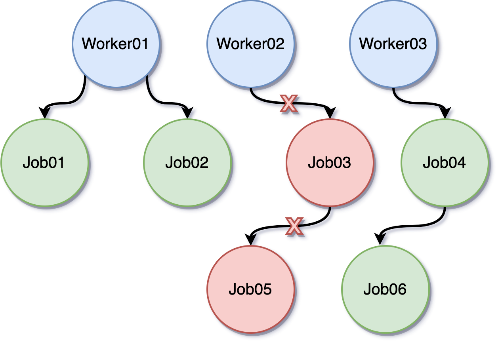

# Lab 1: Concurrent Programming in Go

## Introduction

In Lab 1, you will learn how to build concurrent program with Go.

## Goals of this lab

- Understand concurrent programming
- Understand the memory models in Go
- Learn How to use synchronization primitives in Go

## Race Condition & Critical Section

Race Condition is a situation where two or more goroutines access a shared resource concurrently, and at least one of the goroutines modifies the resource. This can lead to unexpected behavior, such as data corruption or deadlock.

```go
package main

import (
    "fmt"
    "sync"
)

func main() {
    var counter int
    var wg sync.WaitGroup

    for i := 0; i < 1000; i++ {
        wg.Add(1)
        go func() {
            counter++
            wg.Done()
        }()
    }

    wg.Wait()
    fmt.Println(counter)
}
```

Critical Section is a section of code that accesses a shared resource and must be executed by only one goroutine at a time.

The Critical Section in the example listed above is:
```go
counter++
```

Because the `counter++` operation is not atomic or protected by a lock, multiple goroutines can access the shared resource concurrently.
Concurrent access will lead to the race condition.

## Goroutines

Goroutines are lightweight threads of execution that are managed by the Go runtime. Goroutines are used to perform concurrent operations in Go.

```go
package main

import (
    "fmt"
    "time"
)

func main() {
    go func() {
        fmt.Println("Hello, World!")
    }()

    time.Sleep(1 * time.Second)
}
```

## Atomic Operations

In Go, atomic operations are operations that are guaranteed to be executed as a single operation without interruption. This is important in concurrent programming because it ensures that the operation is executed in a consistent state.

In fact, atomic operations are achieved by atomic instructions, provided by the hardware. These instructions are used to perform operations on shared memory in a way that is guaranteed to be atomic.

- [[University of Washington CSE378] Atomic Operations](https://courses.cs.washington.edu/courses/cse378/07au/lectures/L25-Atomic-Operations.pdf)

```go
package main

import (
    "fmt"
    "sync/atomic"
)

func main() {
    var counter int32
    atomic.AddInt32(&counter, 1)
    fmt.Println(counter)
}
```

The example above demonstrates how to use atomic operations in Go. The `AddInt32` function is an atomic operation that increments the value of the counter by 1.

## SpinLock

Spinlock is a synchronization primitive that is used to protect shared resources from concurrent access. A spinlock is used to ensure that only one goroutine can access the shared resource at a time.

Golang doesn't provide a built-in spinlock, but you can implement it using atomic operations.

```go
package main

import (
    "fmt"
    "sync/atomic"
)

type SpinLock struct {
    flag int32
}

func (s *SpinLock) Lock() {
    for !atomic.CompareAndSwapInt32(&s.flag, 0, 1) {
        // Spin until the lock is acquired
    }
}

func (s *SpinLock) Unlock() {
    atomic.StoreInt32(&s.flag, 0)
}
```

## Mutex

In Go, a mutex is a synchronization primitive that is used to protect shared resources from concurrent access. A mutex is used to ensure that only one goroutine can access the shared resource at a time.

The difference between a mutex and a spinlock is that a mutex will put the goroutine to sleep if the resource is already locked, while a spinlock will keep the goroutine busy until the resource is available.

```go
package main

import (
    "fmt"
    "sync"
)

func main() {
    var counter int
    var mu sync.Mutex

    mu.Lock()
    counter++
    mu.Unlock()

    fmt.Println(counter)
}
```

Any other goroutine that tries to access the shared resource while the mutex is locked will be blocked until the mutex is unlocked.

- [Source Code of Mutex in Go](https://go.dev/src/sync/mutex.go)

## Channel
Goroutines run in the same address space, so access to shared memory must be synchronized. In Golang, Channel is a powerful concurrency primitive function used for passing data between different goroutines. It provides an effective communication mechanism that allows goroutines to safely exchange information without requiring additional synchronization mechanisms.

To create a channel, you can use Golang's built-in **`make`** function to establish an integer-type channel. Once successfully created, you can send data to the channel and receive data in another goroutine.

Channels can be used to receive and send data through the **`<-`** operator:
```go
var c chan int

ch := make(chan int)
cs := make(chan string)
cf := make(chan interface{})

ch <- v    // transmit v to channel ch
v := <-ch  // receive data from channel 'ch'，and asign value to v

close(ch) //close Channel
```

You can also read a channel with iteration (**`for range`**):
```go
func main() {
  ch := make(chan int)
  go func() {
    for i := 0; i < 10; i++ { //assign integers to ch
      ch <- i
    }
    close(ch)
  }()

  for v := range ch { //receive datas from ch iteratively
    fmt.Println(v)
  }
}
```

###  :dart: Unbuffered channel 
In fact, channels can be categorized into various types based on different characteristics. According to buffer capacity, channels can be divided into two types: **unbuffered channels** and **buffered channels**. 
When we used make to create a channel above, we did not assign it a capacity value. By default, the buffer capacity would be 0, making the created channel an **unbuffered channel**. Unbuffered channels perform both sending and receiving operations with blocking operation, i.e., if a function attempts to read from the channel (**`v := <-ch`**), it will be blocked until the channel receives data. Similarly, any send operation (**`ch <- i`**) will also be blocked until the data in the channel is read out.

Therefore, we can understand that unbuffered channels ensure that both read and write operations must be completed before the main program finished, achieving synchronization through this characteristic. As a result, this type of channel **does not require additional synchronization mechanisms**.
```go
func main() {
    c := make(chan bool)
    go func() {
        fmt.Println("free5GC so Good")
        c <- true
    }()
    <-c
}
```
In this example, the main function ultimately uses **`<-c`**. Due to the "blocking" characteristic of unbuffered channels, the main function must wait for the channel to read out a value before it terminats.

###  :dart: Buffered channel 
Buffered channels differ from unbuffered channels in that, as long as the buffer has sufficient capacity, the channel can continue receiving values without requiring them to be read immediately. This means that operations will not be blocked, and the main program does't need to wait for the channel to read out values before it terminates:
```go
func main() {
    c := make(chan bool, 1)  //Declare the capacity value (=1) of the buffer
    go func() {
        fmt.Println("free5GC so Good")
        c <- true
    }()
    <-c
} 
```
When a buffered channel receives a value with **`c <- true`**, the main program will not wait for the channel to read the value and will terminate prematurely. As a result, "free5GC so Good" will not be printed. This is the biggest difference between buffered and unbuffered channels.

### :dart: Unidirectional Channel
Channels is directional, categorized into **Bidirectional and Unidirectional**. **Unidirectional channels** only allow send or receive operations, and can be divided into **send-only channels** and **receive-only channels** furtherly. The characteristic of unidirectional data transmission provides higher security and readability in programs.

Previously, we created the most common Bidirectional channels by simply declaring the data type required by the channel or specifying the buffer capacity. When creating unidirectional channels, the **`<-`** operator is used to indicate the direction.
* **Read-Only Channel**:
    * Also known as **Receive-Only Channels**
    * Only allow read operations from the channel, no write operations
    * Restrict goroutines to only read data from the channel, which can improve the program's readability
    * Creation method:
    ```go
    c := make(<- chan int, 10) //notice the <- operator direction
    c <- 1 //cannot write to c
    fmt.Println(<-c)
    ```
* **Write-Only Channel**:
    * Also known as **Send-Only Channel**
    * Only allow write operations from the channel, no read operations
    * Sending data to other goroutines and enhancing security
    * Creation method:
    ```go
    c := make(chan <- int, 10)
    c <- 1
    ```
## Select
In the previous sections, we learned how to create channels and categorize them. We understand that when a single channel performs a send or receive operation, it is a blocking operation. When a program involves multiple channels for communication, Golang provides the select statement for this purpose. It allows a goroutine to wait on multiple communication operations simultaneously. Its usage is similar to **`switch`**, relying on **`case`** and **`default`**.

**`select`** is in blocking operations; it starts execution only when a `case` is ready. Unlike **`switch`**, **`select`** doesn't execute cases **in order** but **randomly chooses** one from the ready cases (channels). There are several characteristics：
* **`select`** can only work with channels; using other types will result to error
* If a channel has no value to read, it causes a panic
* When none of the cases are ready, **`select`** executes the **`default`**. Notice that without a **`default`** case, select will be blocked if none of the cases are ready
```go
func main() {
    ch := make(chan int, 1)

    select {
    case <-ch:
        fmt.Println("random 01")
    case <-ch:
        fmt.Println("random 02")
    default:
        fmt.Println("exit")
    }
}
```
In the example above, due to **`ch`** does not have a value, none of the cases are ready, so the **`default`** case will be executed directly, then printing "exit".
### :tada: Setup Timeout mechanism
Sometimes, we encounter situations where a goroutine takes too long to execute or gets into blocking. In such cases, we don't want the entire program to be blocked within **`select`**. To handle this, we can setup **`timeout`** with **`select`**:
```go
func main() {
    timeout := make(chan bool, 1)
    go func() {
        time.Sleep(2 * time.Second)
        timeout <- true
    }()
    ch := make(chan int)
    select {
    case <-ch:
    case <-timeout:
        fmt.Println("Open5GS")
    case <-time.After(time.Second * 1): //Create a Read-Only Channel which will receive time.Time value
        fmt.Println("free5GC")
    }
}
```
In the example above, Once the **`select`** operation exceeds 1 second, and then it would print "free5GC".

## WaitGroup
Previously, you have learned about concurrency for goroutines, but how can you control the concurrency? One of the ways is through **`WaitGroup`**. When you have a task that you want to split it into different jobs for execution, you need to make the main goroutine waiting for the other goroutines being completed before continuing execution.

Typically, you need to declare a WaitGroup with a **`pointer`**. There are 3 ways to declare it:
```go
wg := &sync.WaitGroup{}

wg := new(sync.WaitGroup)

var wg = &sync.WaitGroup{} //global declaration
```
After declaring it, you can use an integer to add tasks:
```go
func main() {
var wg sync.WaitGroup

    wg.Add(2)//integer means the amounts you have to wait
gofunc() {
        time.Sleep(2 * time.Second)
        fmt.Println("job 1 done.")
        wg.Done()
    }()
gofunc() {
        time.Sleep(1 * time.Second)
        fmt.Println("job 2 done.")
        wg.Done()
    }()
    wg.Wait() // make the main goroutine waiting other goroutines
    fmt.Println("All Done.")
}
```

:star: **Notice**: Every time you call **`wg.Add(int)`**, you must ensure that the number of times you call **`wg.Add()`**, there should be a corresponding **`wg.Done()`** when the wait group completes. Otherwise: 
* goroutines numbers > wg.Add numbers : some goroutines would not execute
* goroutines numbers < wg.Add numbers : cause Deadlock
    
## Context
Context is another method to control concurrency. It can manage the termination of multiple goroutines and resources allocation. 
In the **WaitGroup** chapter, we introduced spliting a task into multiple jobs to run in the background. If you want to proactively notify and stop running jobs, you can achieve this with **`channel+select `** statements. However, if the situation is more complex, such as having a large number of background goroutines or goroutines within goroutines, you will need a more powerful tool.



As shown in the diagram above, there are 3 worker nodes, each with many running jobs. We can declare **`context.Background()`** in the main program and create a separate **`context`** for each worker node. This way, closing one of the contexts will stop the jobs running in that worker.
```go
func main() {
    ctx, cancel := context.WithCancel(context.Background())

    go worker(ctx, "node01")
    go worker(ctx, "node02")
    go worker(ctx, "node03")

    time.Sleep(5 * time.Second) //stop the context (goroutine) after 5 seconds
    fmt.Println("stop the gorutine")
    cancel()
    time.Sleep(5 * time.Second) //canceling needs some time
}

func worker(ctx context.Context, name string) {
    for {
        select {
        case <-ctx.Done(): //ctx is canceled, from withCancel function
            fmt.Println(name, "got the stop channel")
            return
        default:
            fmt.Println(name, "still working")
            time.Sleep(1 * time.Second)
        }
    }
}
```
As above statement, you can stop multiple worker nodes with a single context simultaneously. You can also implement a graceful shutdown to cancel the running jobs through this approach.

Of course, you can also declare multiple contexts and **`cancel`** functions, waiting for goroutines to complete their jobs with **`cancel`** and **`Done`**:
```go
func main() {
	ctx1, cancel1 := context.WithCancel(context.Background())
	ctx2, cancel2 := context.WithCancel(context.Background())

	go func() {
		task1()
		cancel1() //call cancel1 function
	}()

	go func() {
		task2()
		cancel2()
	}()
	
	<-ctx1.Done() //blocked until the context is canceled
	<-ctx2.Done()
	
	//-----------------
	// keep going down to execute
}

func task1() {
	fmt.Println("Starting job1")
	time.Sleep(3 * time.Second)
	fmt.Println("Finished job1")
}

func task2() {
	fmt.Println("Starting job2")
	time.Sleep(2 * time.Second)
	fmt.Println("Finished job2")
}
```

## Exercise
- What is atomic operation?
- Will the following work in parallel code?
```go
var a int64

func main() {
    var wg sync.WaitGroup
    wg.Add(1)
    
    go func() {
        increment()
        wg.Done()
    }()

    wg.Wait()

    fmt.Println("Final value of a:", a)
}

func increment() {
    for i := 0; i < 100000000; i++ {
        atomic.AddInt64(&a, 1)
    }
}
```
- What do the **`wg.Add(1)`** and **`wg.Done()`** do in the above statement? And what does the **`1`** repersent?
- Please define a Counter struct with an integer field and a sync.Mutex, then implement a function to increment the counter safely.
- Why is there a fetal error in following code?
```go=
func main() {
    var intChan chan int
    fmt.Println(intChan)
    intChan <- 10
}
```

