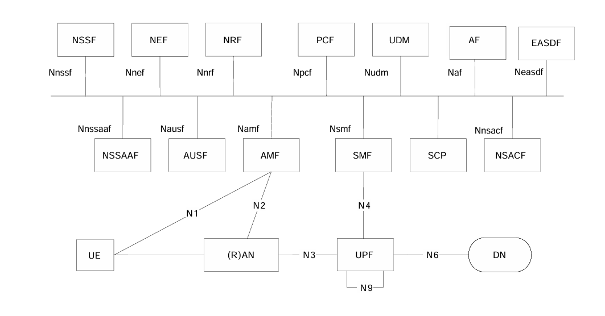
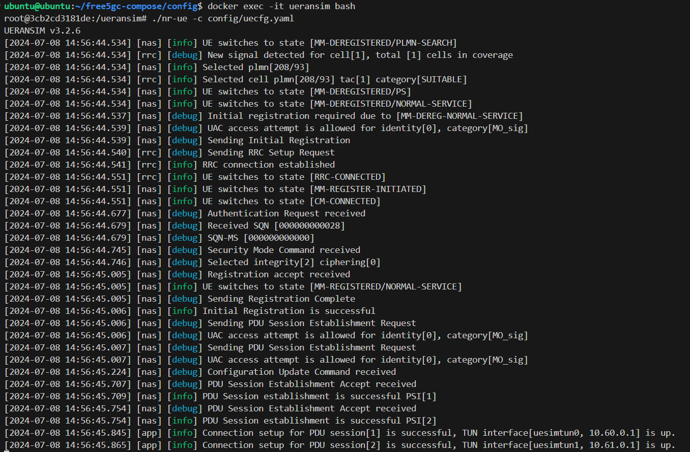

# Lab 3: Deploying free5GC

## Introduction

In Lab3, you will learn how to deploy free5GC with docker and set up interface network.

## Goals of this lab

- Understand listening address
- Learn how to deploy free5GC with docker
- Learn how to use free5GC

## Preparation

- Install GTP5G: refer [GTP5G github](https://github.com/free5gc/gtp5g) to install

- Install Docker Engine and Docker Compose: refer [Docker Website](https://docs.docker.com/engine/install/ubuntu/) to install

- Install `bridge-utils` package for `brctl` command.

## Listening Address

Listening Address is the IP address and port used by a server to listen for connections from clients. These addresses and ports are used to accept requests from clients. ex: 192.168.100.101:12345

In free5GC, each NF (Network Function) has its own listening addresses used to receive and process requests sent by other NFs.

## N2 & N3 & N4 interface



- N2: handles control signaling between the `gNB` and `AMF`
- N3: manages user data transmission between the `gNB` and `UPF`
- N4: controls user plane configuration and session management between the `SMF` and `UPF`

These three interfaces are the most important interfaces in the 5G system. Therefore, this lab will teach you how to configure the addresses for these interfaces.

### N6

Interface to data network.

### N9

Interface for transmitting the data plane traffic between `I-UPF` and `PSA-UPF`.

More details:
- [What is the 5G User Plane Function (UPF)?](https://techcommunity.microsoft.com/t5/azure-for-operators-blog/what-is-the-5g-user-plane-function-upf/ba-p/3690887)

## Docker bridge network

Docker Bridge Network is one of the most commonly used network modes in Docker. It allows Docker containers to communicate with each other through a virtual bridge. This mode is mainly used for communication between containers and between containers and the host machine.

After installing Docker Engine, there will be a default bridge network named `docker0`, with a subnet of `172.17.0.0/16`. You can use `brctl show` to see the bridge information.

```sh
~$ brctl show
bridge name     bridge id               STP enabled     interfaces
docker0         8000.02426fa2174a       no
```

If we run a container, a pair of veth interfaces will be created, with one placed on `docker0` and the other inside the container. This allows the container to communicate with other containers on the bridge or with the host.

```sh
~$ docker run -dit --name alpine1 alpine ash
7ef26c2ccd704b35ec168baa498239a773e7fd8ed0cd8db9ebb24638c14e46b2

// docker0 bridge has one veth to container
~$ brctl show
bridge name     bridge id               STP enabled     interfaces
docker0         8000.02426fa2174a       no              veth43f5e85
```

Since the Docker bridge is implemented based on the Linux bridge, we can use `brctl` or `docker cli` to managing bridges. [brctl document](https://man7.org/linux/man-pages/man8/brctl.8.html)

## Iptable Setting

In this lab, `UPF` forward packet to `n6gw`. `n6gw` will forward packets from `UPF` to dn and do SNAT(source NAT). Rules are set up in `upf-iptables.sh` and `n6gw-iptables.sh`.

`upf-iptables.sh`

```sh
# delete default route
ip route delete default via 10.100.3.1
# add default route to n6gw n6net ip through dn0 interface
ip route add default via 10.100.6.101 dev dn0

# add accept forward rule in the top of the FORWARD table
iptables -I FORWARD 1 -j ACCEPT
```

`n6gw-iptables.sh`

```sh
# delete default route
ip route delete default
# add default route to n6net gateway ip through dn0 interface
ip route add default via 10.100.6.1 dev dn0

# added route from UPF dnn CIDR to UPF n6net ip
ip route add 10.60.0.0/16 via 10.100.6.100
ip route add 10.61.0.0/16 via 10.100.6.100

# do snat(source nat) at dn0 interface output packet
iptables -t nat -A POSTROUTING -o dn0  -j MASQUERADE
# add accept forward rule in the top of the FORWARD table
iptables -I FORWARD 1 -j ACCEPT
```

## Exercise: Configure N2 & N3 & N4 interface in Docker Compose

In this exercise, we will use docker bridge network to set up these three interfaces.

In bottom of exercise/deploy_exercise.yaml, you can find network setting.

```yaml
networks:
  privnet:
    ipam:
      driver: default
      config:
        - subnet: 10.100.200.0/24
    driver_opts:
      com.docker.network.bridge.name: br-free5gc
```

For example, `privnet` is the bridge network for NFs internal communicaion. ex: Nnrf, Nudm...

Each NF, except for the `UPF`, is assigned an IP address within a `privnet` for internal communication. And assign it an alias for ease of use.

```yaml
networks:
  privnet:
    aliases:
      - udr.free5gc.org
```
We create four bridge networks named `n2net`, `n3net`, `n4net` and `n6net`. Our goal is respectively assigned network to `AMF`, `SMF`, `UPF` and `UERANSIM`. All of N1 msgs are carried on NGAP interface.

```yaml
n3net:
  ipam:
    driver: default
    config:
      - subnet: 10.100.3.0/24
  driver_opts:
    com.docker.network.bridge.name: br-n3

n4net:
  ipam:
    driver: default
    config:
      - subnet: 10.100.4.0/24
  driver_opts:
    com.docker.network.bridge.name: br-n4

n6net:
  ipam:
    driver: default
    config:
      - subnet: 10.100.6.0/24
  driver_opts:
    com.docker.network.bridge.name: br-n6
    com.docker.network.container_iface_prefix: dn
```

Here is the sample of assign `n3net` to upf :
```yaml
networks:
  n3net:
    aliases:
      - upf.n3.org
    ipv4_address: 10.100.3.100
```

After assigning the networks, it is necessary to update the IP addresses in the corresponding NF configurations.

In `gnbcfg.yaml`, `amfcfg.yaml`, `smfcfg.yaml` and `upfcfg.yaml`, you can find the settings to configure IP addresses as follows.

```yaml
pfcp: # the IP address of N4 interface on this SMF (PFCP)
  # addr config is deprecated in smf config v1.0.3, please use the following config
  nodeID: TODO # the Node ID of this SMF
  listenAddr: TODO # the IP/FQDN of N4 interface on this SMF (PFCP)
  externalAddr: TODO # the IP/FQDN of N4 interface on this SMF (PFCP)
```

Please replace `TODO` with the configured N2, N3, and N4 addresses.

Tips:
In `smfcfg.yaml`, you will configure the `UPF` N3 interface address because it is required for setting up sessions during SM context creation. If you only use an alias when configuring this address, it may cause DNS resolution issues. Therefore, in `deploy_exercise.yaml`, you should set a static IP address for the `UPF` N3 network and use it here.

And remove `gnb.free5gc.org` in `free5gc-compose/config/uecfg.yaml`

```yaml
# List of gNB IP addresses for Radio Link Simulation
gnbSearchList:
  - 127.0.0.1
  - gnb.free5gc.org # remove this line
```

After configuring, clone [free5gc-compose](https://github.com/free5gc/free5gc-compose). Then move `free5GLab/lab3/exercise/deploy_exercise.yaml` to `free5gc-compose/` and copy the contents of the files from the `free5GLab/lab3/exercise/config` directory to `free5gc-compose/config`.

You can use these commands to start or stop docker compose.

```sh
cd ~/free5gc-compose

// start
docker compose -f deploy_exercise.yaml up

// remove
docker compose -f deploy_exercise.yaml down
```

Refer [Create Subscriber via Webconsole](https://free5gc.org/guide/Webconsole/Create-Subscriber-via-webconsole/#5-add-new-subscriber) to create subscriber

In addition, attach to ueransim container and run UE

```sh
// attach to UERAMSIM container
docker exec -it ueransim bash

// run ue
./nr-ue -c config/uecfg.yaml
```

And the expected result looks like:


And use `ping` to test it can reach date network

```sh
ping -I uesimtun0 8.8.8.8
```

If you encounter any issues during the exercise, you can refer to the `free5GLab/lab3/ans` folder.

## Reference

- [3GPP TS 23.501](https://portal.3gpp.org/desktopmodules/Specifications/SpecificationDetails.aspx?specificationId=3144)
