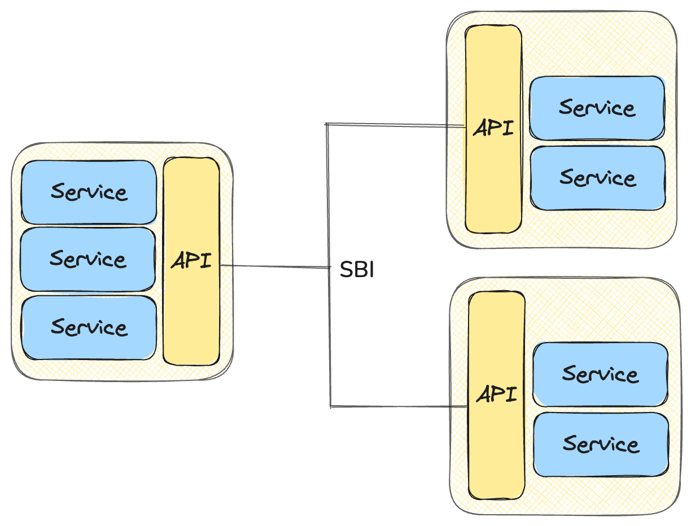

# Lab 4: Service-based Architecture (HTTP Protocol)

## Overview

## Service-Based Architecture (SBA) vs. Service-Oriented Architecture (SOA)

If you search for "service-based architecture" on Google, you will find SOA (service-oriented architecture) as the most popular term. However, they are quite different. SOA is an organizational architecture, whereas service-based architecture is a software architecture. SOA describes the entire system an organization provides to its customers, while service-based architecture describes services in the individual application that make up the system. In this lab, we will focus on service-based architecture.

### What does service-based architecture mean?

Service-based architecture is a software architecture that is based on the idea of services. An application is composed of a set of services. Each service is responsible for a specific set of tasks and should provides an interface for clients to interact with it. For example, a *todo-list* application may have a service for managing tasks, a service for managing users. Clients can interact with the application by sending requests (e.g., creating a task) to the services.

### SBA in 3GPP

In the context of 3GPP, a network function is an application that provides a set of services to the network. A 5G network is composed of a set of network functions. Each network function is responsible for a specific set of services. For example, AMF (Access and Mobility Management Function) is responsible for the access and mobility management of the network, SMF (Session Management Function) is responsible for the management of sessions.

To speed up the development of the network function, the 3GPP has specified a set of design principles for the development of network functions. One of them is that client interface of the services should designed as RESTful APIs (Application Programming Interfaces, that allows two applications to communicate with each other). Since services are reusable to every NF, this interface is also called **Service-Based Interface (SBI)**.

## RESTful API

### HTTP Protocol

### HTTP Methods

### HTTP Status Codes

## References

1. [https://www.youtube.com/watch?v=l6-za59eMKQ](https://www.youtube.com/watch?v=l6-za59eMKQ)
2. [https://ithelp.ithome.com.tw/m/articles/10291193](https://ithelp.ithome.com.tw/m/articles/10291193)
3. [https://www.3gpp.org/technologies/openapis-for-the-service-based-architecture](https://www.3gpp.org/technologies/openapis-for-the-service-based-architecture)
4. [https://aws.amazon.com/what-is/api/](https://aws.amazon.com/what-is/api/)
