# Lab 5: 5G protocol stack observation (tcpdump)

## Introduction

In Lab5, you will learn how to use the Linux command `tcpdump` to capture packets passing through a network interface.

## Goals of this lab

- Learn how to use tcpdump capture packets
- Learn how to use wireshark observing captured packets on N2, N3 and N4

## Preparation

- Install [Wireshark](https://www.wireshark.org/download.html) to install for Windows and Mac, or using `sudo apt install wireshark` for ubuntu
- Install free5GC: refer [free5GC Install](https://free5gc.org/guide/3-install-free5gc/) 
- Install Packetrusher as our UE/gNB simulator: refer [PacketRusher Install](https://free5gc.org/blog/20240110/20240110/) to install

## What is Promiscuous Mode ?

Network interface cards (NICs) have two configuration modes: **Normal Mode** and **Promiscuous Mode**.  

In the standard state, NICs operate in Normal Mode, where the network card only accepts data from the network port if the destination address is specifically directed to it. However, when analyzing network traffic, identifying network packets, and troubleshooting network issues, Promiscuous Mode is often enabled. In this mode, the NIC will receive and process all packets passing through the network interface, regardless of their destination.

## What is Packet Caputure (PCAP) File ?

PCAP file is a file format used to capture and store network traffic data, the data including details like source and destination IP addresses, ports, protocols, and the packet's payload.
PCAP file can be opened and analyzed using tools like Wireshark and tcpdump respectively. These tools allow users to inspect the network traffic in detail, apply filters, and decode protocols.

> Common Uses for PCAP file :  
> Network Troubleshooting, Security Analysis, Network Protoco Development

## How to Use Tcpdump ?

### Basic usage

> Tips : tcpdump requires root privileges.

#### Capture all packet on {interface}
```
$ tcpdump -i {interface name}
```

#### Write out capture result to PCAP file
```
$ tcpdump -i {interface name} -w {XXX}.pcap
```

#### Capture packets from a specific source IP or port
```
$ tcpdump host {host ip}
$ tcpdump port {port number}
$ tcpdump host {host ip} and port {port number}
```

#### Capture the first n packets
```
$ tcpdump -c {n}
```

#### Capture packets from a specific protocol
```
$ tcpdump tcp
$ tcpdump udp
$ tcpdump icmp
```

### Simple Example
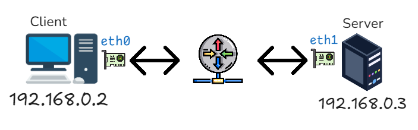
#### Assuming we have a network configuration as shown in the diagram, and we want to capture the first 10 **ICMP packets** from the **Server** on the **Client's eth0** interface, and save the result to icmp.pcap file, we can use the following command.

```
$ tcpdump icmp host 192.168.0.3 -i eth0 -c 10 -w icmp.pcap
```

## Tcpdump Caputure Packet Passing Through N2 & N3

#### In this part, we will capture the packets passing through the N2 and N3 paths, and in the next part, we will use Wireshark to observe which messages are transmitted using NGAP packets when the UE connects and disconnects to the core network.

- N2: handles control signaling between the `gNB` and `AMF`
- N3: manages user data transmission between the `gNB` and `UPF`
- NGAP: Next Generation Application Protocol, Used for signaling interactions between base stations (gNB) and the 5G core network (5G Core) in 5G networks. It operates over the **N2 interface** within the 5G network architecture, primarily responsible for control plane message exchange.

### <u>Step 1 : </u>
#### Check your AMF & UPF IP address (On free5GC)
> For my example, it's 192.168.56.102 

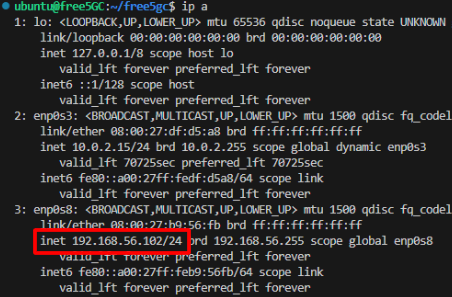

### <u>Step 2 : </u>
#### Check your UE & gNB IP address (On PacketRusher)
> For my example, it's 192.168.56.103

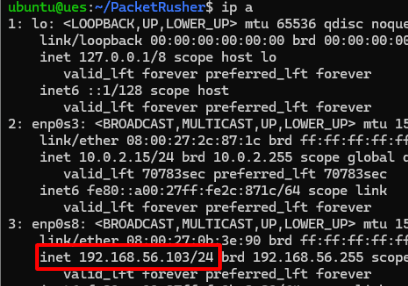

### <u>Step 3 : </u>
#### Run free5GC (On free5GC)
```
$ cd free5gc
$ ./run.sh
```

### <u>Step 4 : </u>
#### Start capturing packets and save to N2N3.pcap (On free5GC or PacketRusher)
```
$ tcpdump -i enp0s8 -w N2N3.pcap
```

### <u>Step 5 : </u>
#### Start the UE connection (On PacketRusher)
```
$ cd PacketRusher
$ ./packetrusher ue
```

### <u>Step 6 : </u>
#### Since the UE needs to go through the N3 interface to communicate with the Data Network, we can send ICMP packets externally to facilitate observation later.
On PacketRusher : 

```
$ ip vrf exec vrf0000000003 ping 8.8.8.8
```


### <u>Step 7 : </u>
#### Shutdown UE.

### <u>Step 8 : </u>
#### Stop tcpdump, and you can get the PCAP file.

## Wireshark Packet filter Skills

In this part, we will use Wireshark to observe which messages are transmitted and the protocol stack using NGAP packets when the UE connects and disconnects to the core network.  
In Wireshark, you can enter conditions at the top to filter out the specific packets you need from all the captured packets.

#### Common filtering conditions includes : 
- Specific IP : ```ip.addr == {specific IP}```
- Source IP : ```ip.src == {src IP}```
- Source Port : ```tcp.srcport == {port number}```
- Destination IP : ```ip.dst == {dst IP}```
- Destination Port : ```tcp.dstport == {port number}```
- MAC Address : ```eth.addr == {MAC Address}```
- Protocol types : ```ngap``` or ```icmp``` or ```tcp``` or ```sctp``` or others 

### <u>Step 1 : </u>
#### Open N2N3.pcap on Wireshark application

### <u>Step 2 : (N2 observation)</u> 
#### Enter filtering conditions
Since we want to observe packets between the gNB and the AMF, we can set the source and destination IP addresses as filtering conditions, as well as filter for NGAP packet types.

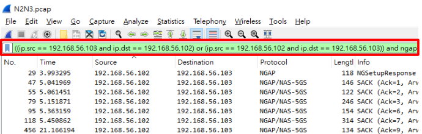

#### Sorted by time
You can observe from the 'Info' field what setup procedures the UE performed with the AMF through the gNB.

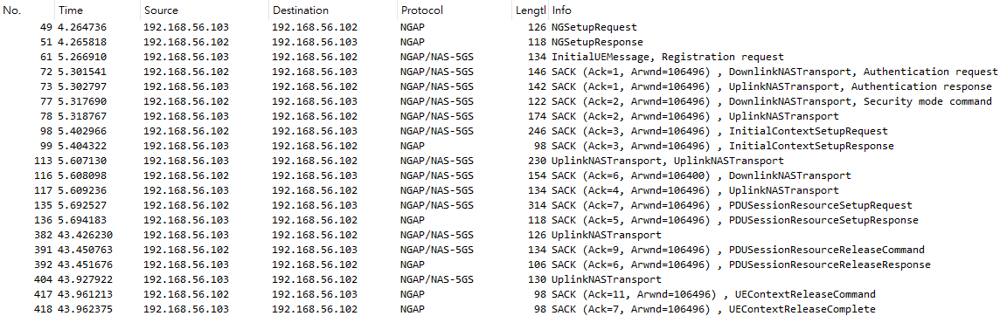

#### Message Type Explanation  
- NGSetupRequest & NGSetupResponse : The purpose of the NG Setup procedure is to exchange application level data needed for the NG-RAN node and the AMF to correctly interoperate on the NG-C interface. This procedure shall be the first NGAP procedure triggered after the TNL association has become operational. The procedure uses non-UE associated signalling. 

- InitialUEMessage (Registration request) : The Initial UE Message procedure is used when the NG-RAN node has received from the radio interface the first uplink NAS message transmitted on an RRC connection to be forwarded to an AMF.

- DownlinkNASTransport : The Downlink NAS Transport procedure is used when the AMF only needs to send a NAS message transparently via the NG-RAN node to the UE, and a UE-associated logical NG-connection exists for the UE or the AMF has received the RAN UE NGAP ID IE in an INITIAL UE MESSAGE message either over this NG interface instance or another NG interface instance.

- UplinkNASTransport : The Uplink NAS Transport procedure is used when the NG-RAN node has received from the radio interface a NAS message to be forwarded to the AMF to which a UE-associated logical NG-connection for the UE exists.

- InitialContextSetup : The purpose of the Initial Context Setup procedure is to establish the necessary overall initial UE Context at the NGRAN node, when required, including PDU session context, the Security Key, Mobility Restriction List, UE Radio Capability and UE Security Capabilities, etc. The AMF may initiate the Initial Context Setup procedure if a UEassociated logical NG-connection exists for the UE or if the AMF has received the RAN UE NGAP ID IE in an INITIAL UE MESSAGE message either over this NG interface instance or another NG interface instance, The procedure uses UE-associated signalling.

- PDUSessionResourceSetup : The purpose of the PDU Session Resource Setup procedure is to assign resources on Uu and NG-U for one or several PDU session resources and the corresponding QoS flows, and to setup corresponding Data Radio Bearers for a given UE. The procedure uses UE-associated signalling.

- PDUSessionResourceRelease : The purpose of the PDU Session Resource Release procedure is to enable the release of already established PDU session resources for a given UE. The procedure uses UE-associated signalling.

- UEContextRelease : The purpose of the UE Context Release Request procedure is to enable the NG-RAN node to request the AMF to
release the UE-associated logical NG-connection due to NG-RAN node generated reasons. The procedure uses UEassociated signalling.

#### Protocol Stack & Packet Structure & Information Element (IE)
> Example : InitialUEMessage (Registration Request)
 
The protocol stack in this packet is :

- SCTP
- NGAP  

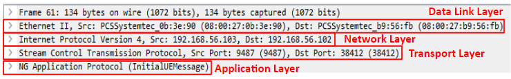

Packet decapsulate :  

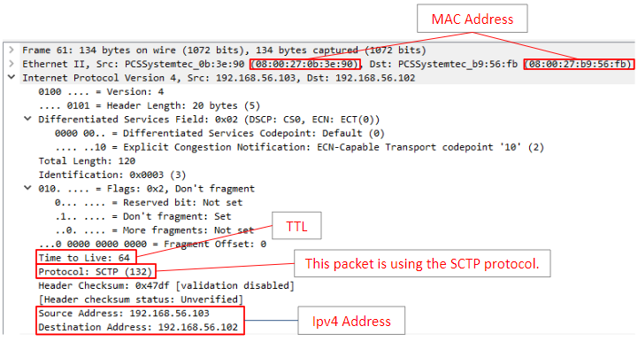
- TTL : The maximum distance a packet can be transmitted when passing through a router

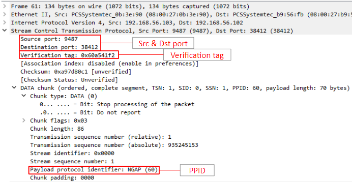
- Verification tag : The verification tag in SCTP is used to ensure that the packet belongs to a specific SCTP session.
- Paylad protocol identifier (PPID) : The payload of this data chunk contains NGAP (Next Generation Application Protocol) protocol data.  

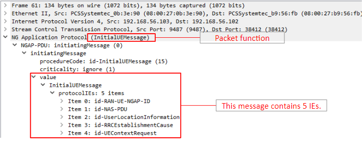
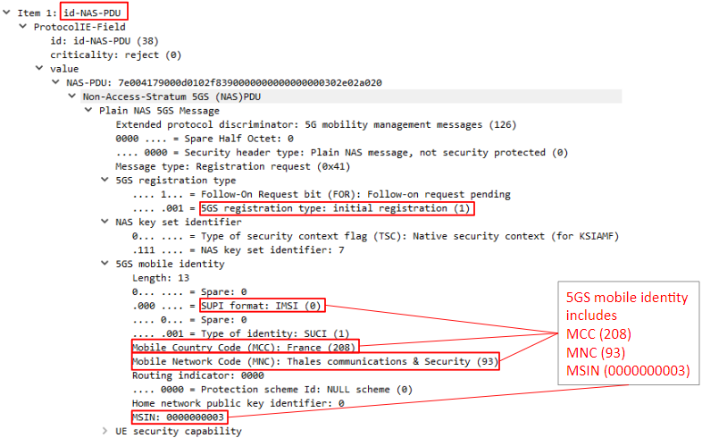

### <u>Step 3 : (N3 observation)</u> 
> The N3 interface is responsible for transmitting user data (such as internet traffic, voice, video, etc.), and it typically uses GTP-U (GPRS Tunneling Protocol - User Plane) for encapsulation and transmission.  
In **Step 6** of capturing packets, we send ICMP packets to the Data Network, which will be observed here.

#### Enter filtering conditions


#### Protocol Stack

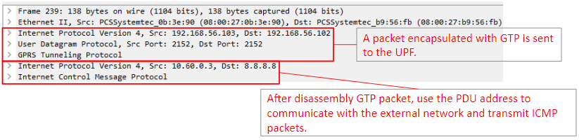


## Exercise: PFCP Message Type and Protocol Stack Observation on N4

In this exercise, you need to follow the steps below to capture PFCP packets on the N4 interface, write down the Message Type of each packet in order, and describe the Protocol Stack of the PFCP packet.

- N4: controls user plane configuration and session management between the `SMF` and `UPF`

### <u>Step 1 : </u>
#### Check the network configuration on N4.
```
vim ~/free5gc/config/smfcfg.yaml
```
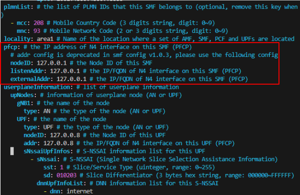

#### Also, check the corresponding network interface Name.
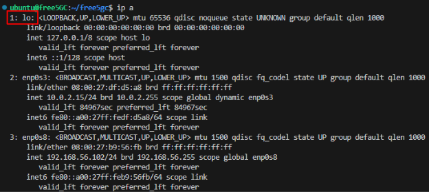

### <u>Step 2 : </u>
#### Start capturing packets and save to N4.pcap (On free5GC)
```
$ tcpdump -i lo -w N4.pcap
```

### <u>Step 3 : </u>
#### Run free5GC (On free5GC)
```
$ cd free5gc
$ ./run.sh
```

### <u>Step 4 : </u>
#### Start the UE connection (On PacketRusher)
```
$ cd PacketRusher
$ ./packetrusher ue
```

### <u>Step 5 : </u>
#### After Connected.
- Shutdown UE.
- Shutdown free5GC.

### <u>Step 6 : </u>
#### Stop tcpdump, and you can get the PCAP file.

### <u>Step 7 : </u>
#### Open N4.pcap on Wireshark application

### <u>Step 8 : </u>
#### Enter filtering conditions
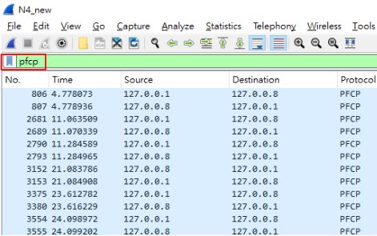

### Question
> Observe the captured PFCP packets and answer the following questions.
#### Part 1 : Write down the Message Type of each packet in order
#### Part 2 : Describe the Protocol Stack of the PFCP packet

## Reference
- [3GPP TS 38.413](https://www.etsi.org/deliver/etsi_ts/138400_138499/138413/15.00.00_60/ts_138413v150000p.pdf)
- [Promiscuous-mode](https://tigercosmos.xyz/post/2023/05/system/promiscuous-mode/)