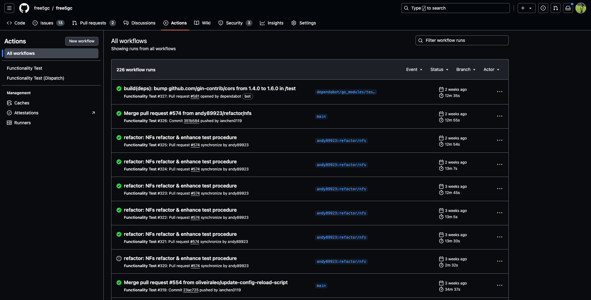

# Lab 7: CI/CD with GitHub Actions

## Introduction

In Lab 7, you will learn how to use GitHub Actions to automate the CI/CD process.

## Goals of this lab

- Understand What is CI/CD
- Understand how to use GitHub Actions

## What is CI/CD?

CI/CD is a part of DevOps practices that automates the integration and delivery of code changes. CI/CD pipeline automates the process of integrating code changes, building the code, testing the code, and deploying the code to production.

### Continuous Integration (CI)

Continuous Integration (CI) is a software development practice where developers integrate code changes into a shared repository frequently. Each integration is verified by an automated build and automated tests. This practice helps to detect and fix integration errors quickly.

A stable CI pipeline ensures that the code is always in a deployable state.
For the CI pipeline to be successful, it should be:
- reproducible: The testing environment should be consistent across all stages of the pipeline, it means that the same test should pass on the developer's machine and the CI server.
- reliable: The CI pipeline should be reliable, it should not fail randomly.
- readable: The CI pipeline should be easy to read and understand.

In free5GC, we leverage GitHub Actions to perform the CI process. The CI process includes:
- Linting: Check the code style and formatting.
- Unit Testing: Run unit tests to ensure the code works as expected.
- Build: Build the code to ensure that the code can be compiled successfully.
- Integration Testing: Run integration tests to ensure that the code works well with other components.

Any Pull Request (PR) to the free5GC repository will trigger the CI process. The PR will be merged only if the CI process is successful (and should be approved by the project owner).

### Continuous Deployment (CD)